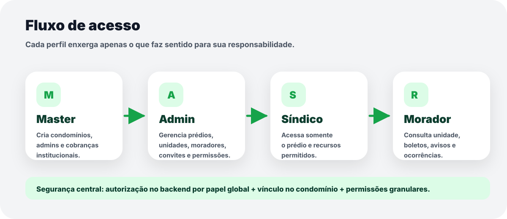
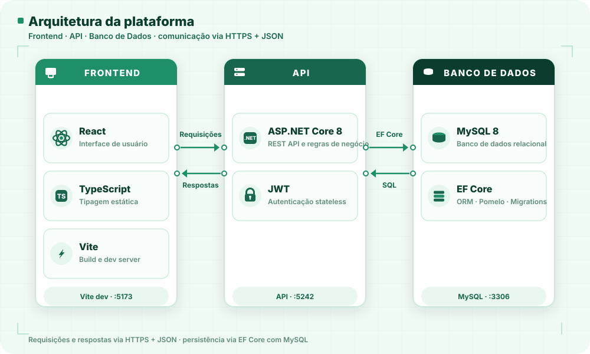

# MORAÊ


**MORAÊ** é uma plataforma full stack para gestão de condomínios, construída como MVP com foco em segurança, arquitetura organizada, experiência visual moderna e dados reais integrados entre backend e frontend.

O projeto resolve um cenário comum em operações condominiais: permitir que diferentes perfis acessem apenas o que faz sentido para sua responsabilidade, sem misturar dados institucionais, operacionais, financeiros ou pessoais.

---

## Destaques


- Aplicação em **PT-BR**, com identidade visual própria.
- Backend em **ASP.NET Core 8**, com Identity, JWT, EF Core, MySQL e AutoMapper.
- Frontend em **React 19**, TypeScript, Vite, Tailwind CSS 4, React Router e Recharts.
- Fluxo real de autenticação, convites, permissões, cobranças, comunicados, ocorrências e notificações.
- Controle de acesso por papel e escopo de condomínio.
- Interface responsiva, clean, com foco em experiência de uso e deploy de MVP.

---

## Visão Geral do Produto

O MORAÊ organiza a gestão condominial em quatro perfis principais:



| Perfil | O que faz | Limite de acesso |
| --- | --- | --- |
| **Master** | Gerencia a plataforma, condomínios, admins institucionais, convites e receita da plataforma. | Não acessa dados internos do condomínio, como unidades e moradores. |
| **Admin** | Gerencia a operação do condomínio: prédios, unidades, moradores, cobranças, avisos e permissões. | Acessa apenas condomínios aos quais está vinculado. |
| **Síndico** | Acompanha o prédio sob sua responsabilidade e os recursos liberados pelo Admin. | Acesso configurável por permissões e vínculo. |
| **Morador** | Consulta suas unidades, boletos, comunicados e ocorrências. | Acessa apenas dados vinculados ao próprio perfil. |

---

## Fluxo Principal

1. O **Master** cadastra um condomínio e cria o primeiro Admin institucional.
2. O sistema gera um convite para o Admin ativar o acesso.
3. O **Admin** aceita o convite, entra no painel e começa a operação.
4. O Admin cadastra prédios, unidades, pessoas e vínculos com unidades.
5. O Admin gera convites para moradores e síndicos.
6. O **Síndico** acessa apenas os prédios e módulos autorizados.
7. O **Morador** acompanha boletos, comunicados, unidades e ocorrências.
8. Notificações e atividades recentes registram eventos importantes da plataforma.

Esse fluxo foi pensado para simular uma operação real de onboarding condominial, desde o cadastro institucional até o uso por moradores.

---

## Módulos Implementados

### Master

- Dashboard com métricas reais de condomínios, convites e receita institucional.
- Gestão de condomínios criados pelo Master.
- Criação de condomínio com primeiro Admin.
- Convites de Admin com link de aceite, cancelamento e status.
- Gestão de Admins institucionais.
- Cobranças institucionais da plataforma.
- Configurações de perfil.
- Notificações integradas.

### Admin

- Dashboard operacional do condomínio.
- Gestão de prédios, unidades e moradores.
- Vínculo de pessoas com unidades.
- Convites para moradores e síndicos.
- Cobranças internas do condomínio.
- Comunicados para o público interno.
- Ocorrências e manutenção.
- Conta bancária e Pix do condomínio.
- Configuração de permissões do síndico.

### Síndico

- Dashboard com visão restrita ao prédio vinculado.
- Consulta de moradores conforme permissão.
- Comunicados e ocorrências conforme liberação do Admin.
- Rotina operacional com escopo controlado.

### Morador

- Dashboard pessoal.
- Consulta de unidade vinculada.
- Boletos e cobranças.
- Comunicados do condomínio.
- Registro e acompanhamento de ocorrências.
- Configurações de perfil.

---

## Arquitetura



O projeto foi organizado para manter separação clara entre responsabilidades, regras de negócio e interface.

### Backend

```text
backend
├── Controllers
├── Services
├── DTOs
├── Models
├── Enums
├── Constants
├── Profiles
├── Data
├── Migrations
├── Middlewares
└── Program.cs
```

Principais decisões:

- Controllers finos, responsáveis por receber requisições e delegar regras.
- Services concentrando validações, permissões e regras de negócio.
- DTOs para entrada e saída da API, evitando expor entidades diretamente.
- AutoMapper para padronizar conversões entre entidades e DTOs.
- EF Core com MySQL para persistência.
- Identity para usuários, roles e segurança.
- JWT para autenticação stateless.
- Middleware global de exceções para respostas consistentes.

### Frontend

```text
frontend/src
├── app
│   ├── providers
│   └── AppRouter.tsx
├── features
│   ├── auth
│   ├── masterDashboard
│   ├── masterCondominiums
│   ├── invitations
│   ├── buildings
│   ├── units
│   ├── people
│   ├── payments
│   ├── notifications
│   └── ...
├── shared
│   ├── components
│   ├── layout
│   └── lib
└── assets
```

Principais decisões:

- Organização por features para facilitar manutenção por módulo.
- Cliente HTTP centralizado para comunicação com a API.
- AuthProvider para hidratar sessão via `/api/me`.
- Rotas protegidas por autenticação e papel.
- Layout compartilhado com Topbar, Sidebar, notificações e identidade visual.
- Componentes reutilizáveis para cards, badges, loaders, modais e dropdowns.
- Sem dependência de dados mockados no MVP: as telas exibem dados vindos da API ou estados vazios reais.

---

## Segurança e Regras de Acesso

O MORAÊ não depende apenas de esconder botões no frontend. A segurança real fica no backend.

Regras aplicadas:

- Autenticação com JWT.
- Autorização por roles: Master, Admin, Syndic e Resident.
- Escopo por condomínio e vínculo ativo.
- Master limitado a dados institucionais da plataforma.
- Admin limitado aos condomínios que administra.
- Síndico limitado ao prédio e permissões configuradas.
- Morador limitado aos próprios dados e unidades.
- Convites com token para primeiro acesso.
- Convites aceitos não exibem link de aceite novamente.
- Convites pendentes podem ser copiados ou cancelados.
- Usuários suspensos perdem acesso operacional.

Esse desenho evita vazamento entre condomínios e separa claramente responsabilidades de plataforma, gestão e uso final.

---

## Stack Técnica

### Backend

- ASP.NET Core 8
- Entity Framework Core
- Pomelo EntityFrameworkCore MySQL
- MySQL 8
- ASP.NET Identity
- JWT Bearer Authentication
- AutoMapper
- Swagger
- dotenv.net

### Frontend

- React 19
- TypeScript
- Vite
- Tailwind CSS 4
- React Router DOM
- Recharts
- @edusites/icons

### Infra e Ferramentas

- Docker Compose
- MySQL 8.4
- EF Core Migrations
- Git/GitHub
- Visual Studio Code

---

## Como Rodar Localmente

### Pré-requisitos

- .NET SDK 8
- Node.js 20 ou superior
- Docker
- MySQL 8, caso não use Docker
- EF Core CLI

Se precisar instalar o EF Core CLI:

```bash
dotnet tool install --global dotnet-ef
```

### 1. Clonar o projeto

```bash
git clone <url-do-repositorio>
cd morae-app
```

### 2. Subir o banco com Docker

```bash
docker compose up -d
```

O `docker-compose.yaml` sobe um MySQL local com:

```text
Database: moraeDB
Porta: 3306
```

### 3. Configurar variáveis do backend

Crie um arquivo `backend/.env` com valores locais. Exemplo:

```env
ConnectionStrings__DefaultConnection=Server=localhost;Port=3306;Database=moraeDB;User=root;Password=root;AllowPublicKeyRetrieval=True;
Jwt__Secret=sua-chave-jwt-com-tamanho-seguro
Jwt__Issuer=Morae
Jwt__Audience=Morae
```

Importante: não versionar `.env` com credenciais reais.

### 4. Aplicar migrations

```bash
dotnet ef database update --project backend/backend.csproj --startup-project backend/backend.csproj
```

### 5. Rodar o backend

```bash
dotnet watch run --project backend/backend.csproj
```

API local:

```text
http://localhost:5242
```

### 6. Rodar o frontend

```bash
cd frontend
npm install
npm run dev
```

Frontend local:

```text
http://localhost:5173
```

Se o Vite subir em outra porta, ajuste a origem permitida no CORS do backend.

---

## Scripts Úteis

### Frontend

```bash
cd frontend
npm run dev
npm run build
npm run lint
```

### Backend

```bash
dotnet build backend/backend.csproj
dotnet watch run --project backend/backend.csproj
dotnet ef migrations add NomeDaMigration --project backend/backend.csproj --startup-project backend/backend.csproj
dotnet ef database update --project backend/backend.csproj --startup-project backend/backend.csproj
```

---

## Endpoints e Fluxos de API

Alguns grupos de endpoints implementados:

| Área | Responsabilidade |
| --- | --- |
| `Auth` | Login e geração de token JWT. |
| `Me` | Dados do usuário autenticado para hidratação da sessão. |
| `Condominium` | Cadastro e gestão institucional de condomínios. |
| `Building` | Gestão de prédios/blocos. |
| `Units` | Gestão de unidades. |
| `Persons` | Pessoas vinculáveis ao condomínio. |
| `PersonUnits` | Vínculos entre pessoas e unidades. |
| `Invitation` | Convites, aceite, cancelamento e ativação de acesso. |
| `Charges` e `Payments` | Cobranças e pagamentos. |
| `News` | Comunicados. |
| `Occurrences` | Ocorrências, manutenção e acompanhamento. |
| `Notifications` | Notificações do sistema. |
| `FinancialAccounts` | Conta bancária e Pix do condomínio. |
| `Permissions` | Permissões e escopo de acesso. |

---

## Decisões de Produto

### Master não é superusuário operacional

Uma decisão importante do MORAÊ é que o Master não acessa tudo. Ele gerencia a plataforma, os condomínios e os admins institucionais, mas não entra nos dados internos de operação do condomínio.

Isso torna o produto mais seguro e mais próximo de um cenário SaaS real.

### Convite é o caminho de criação de acesso

O usuário não recebe uma senha manual cadastrada por terceiros. O fluxo correto é:

1. Uma pessoa é cadastrada.
2. Um convite é gerado.
3. A pessoa acessa o link.
4. A pessoa define sua própria senha.
5. O sistema ativa o papel correto.

Esse fluxo melhora segurança, rastreabilidade e experiência de primeiro acesso.

### Backend é a fonte da verdade

O frontend guia a experiência, mas permissões, escopos e bloqueios importantes são validados no backend.

---

## Experiência de Interface

O design do MORAÊ segue uma proposta visual clean:

- Paleta verde moderna.
- Tipografia Nunito.
- Cards com bordas suaves e sombra leve.
- Modais padronizados.
- Dropdowns customizados.
- Estados vazios claros.
- Mensagens de erro amigáveis.
- Layout responsivo.
- Navegação por perfil.

A interface foi construída para parecer um produto real, não apenas um CRUD técnico.

---

## Status do MVP

O MVP está em fase de preparação para deploy.

Fluxos já conectados:

- Login e autenticação.
- Sessão persistente com `/api/me`.
- Roteamento por perfil.
- Gestão Master.
- Gestão Admin.
- Gestão Síndico.
- Gestão Morador.
- Convites e aceite público.
- Notificações.
- Prédios, unidades e pessoas.
- Cobranças, comunicados e ocorrências.
- Configurações de perfil e dados financeiros.

---

## Próximos Passos

- Integração real com gateway de pagamento ou emissão de boleto.
- Envio de convites por e-mail.
- Upload real de foto de perfil em storage externo.
- Testes automatizados de services e endpoints críticos.
- Observabilidade para deploy: logs estruturados e métricas.
- Pipeline CI/CD.
- Deploy do backend e frontend em ambiente de produção.

---

## O Que Este Projeto Demonstra

Para recrutadores e avaliadores técnicos, o MORAÊ demonstra:

- Construção de uma aplicação full stack de ponta a ponta.
- Modelagem de domínio com múltiplos perfis e regras reais.
- Autenticação e autorização com JWT, Identity e escopo por recurso.
- Integração entre React e ASP.NET Core.
- Uso de migrations, DTOs, services e AutoMapper.
- Preocupação com UX, responsividade e consistência visual.
- Capacidade de transformar regra de negócio em produto navegável.
- Evolução incremental com foco em MVP e deploy.

---

## Resumo Para LinkedIn

Desenvolvi o **MORAÊ**, uma plataforma full stack para gestão de condomínios, com ASP.NET Core 8, React 19, TypeScript, MySQL, Entity Framework Core, Identity, JWT, AutoMapper, Tailwind CSS e Recharts.

O projeto simula um SaaS real com quatro perfis de acesso: Master, Admin, Síndico e Morador. Cada perfil possui permissões e escopos próprios, evitando que dados institucionais, operacionais e pessoais sejam misturados.

Entre os principais fluxos implementados estão: autenticação com JWT, onboarding de condomínio, convites com link de aceite, gestão de prédios, unidades e moradores, cobranças, comunicados, ocorrências, notificações e dashboards por perfil.

Além da parte técnica, trabalhei bastante a experiência do usuário: UI em PT-BR, visual clean, responsivo, consistente e sem depender de dados mockados no MVP.

Esse projeto foi uma oportunidade de praticar arquitetura, segurança, modelagem de domínio, integração frontend/backend e construção de produto com visão de deploy.

---

## Autor

Desenvolvido por **Luiz Elvis** como projeto full stack de portfólio e evolução profissional.
